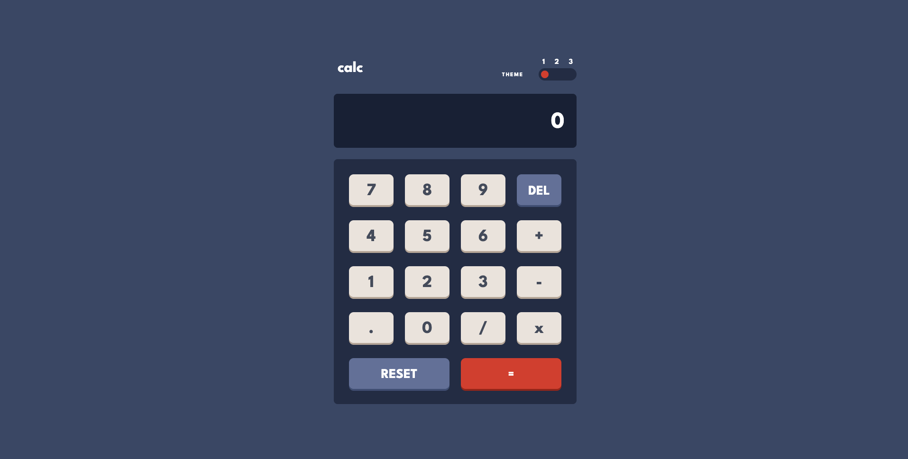
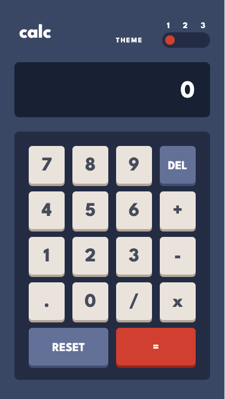
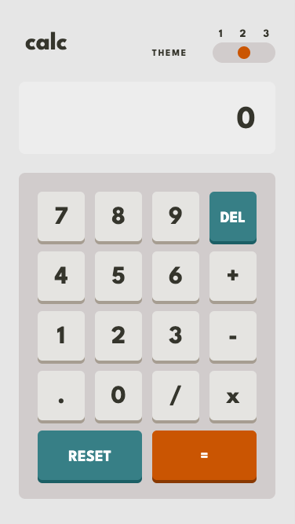
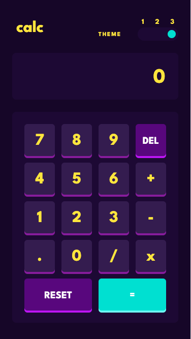

# Frontend Mentor - Calculator app solution

This is a solution to the [Calculator app challenge on Frontend Mentor](https://www.frontendmentor.io/challenges/calculator-app-9lteq5N29). Frontend Mentor challenges help you improve your coding skills by building realistic projects.

## Table of contents

- [Overview](#overview)
  - [The challenge](#the-challenge)
  - [Screenshot](#screenshot)
  - [Links](#links)
- [My process](#my-process)
  - [Built with](#built-with)
  - [What I learned](#what-i-learned)
  - [Continued development](#continued-development)
  - [Useful resources](#useful-resources)
- [Author](#author)
- [Acknowledgments](#acknowledgments)

## Overview

### The challenge

Users should be able to:

- See the size of the elements adjust based on their device's screen size
- Perform mathmatical operations like addition, subtraction, multiplication, and division
- Adjust the color theme based on their preference
- **Bonus**: Have their initial theme preference checked using `prefers-color-scheme` and have any additional changes saved in the browser

### Screenshot






### Links

- Solution URL: [Solution](https://www.frontendmentor.io/solutions/calculator-app-with-vite-vue3-typescript-scss-kOXCOl1pdi)
- Live Site URL: [Live site](https://furxx2000.github.io/Calculator-App/)

### Built with

- Semantic HTML5 markup
- CSS custom properties
- Flexbox
- CSS Grid
- Mobile-first workflow
- [Vite](https://vitejs.dev/) - Frontend build tool
- [Vue3](https://reactjs.org/) - JS library
- [TypeScript](https://www.typescriptlang.org/) - Strongly typing javaScript
- [SCSS](https://sass-lang.com/) - For styles

### What I learned

Use Scss features like @mixin to create key button styles:

```css
@mixin keyType-1($area) {
  grid-area: $area;
  color: var(--text-key-1);
  background-color: var(--bg-key-1);
  box-shadow: 0 4px var(--bg-key-1-shadow);
}

@mixin keyType-2($area) {
  grid-area: $area;
  color: var(--text-key-2);
  background-color: var(--bg-key-2);
  box-shadow: 0 4px var(--bg-key-2-shadow);
}

@mixin keyType-3($area) {
  grid-area: $area;
  color: var(--text-key-2);
  background-color: var(--bg-key-3);
  box-shadow: 0 4px var(--bg-key-3-shadow);
}
```

Then use @each to iteratively add css on each button

```css
$keys1: zero, one, two, three, four, five, six, seven, eight, nine, dot, slash,
  multiply, minus, plus;

$keys2: delete, reset;

@each $key in $keys1 {
  .#{$key} {
    @include keyType-1($key);
  }
}

@each $key in $keys2 {
  .#{$key} {
    font-size: 20px;
    text-transform: uppercase;
    @include keyType-2($key);
    @include desktop {
      font-size: 28px;
    }
  }
}

.equal {
  font-size: 1.2rem;
  @include keyType-3(equal);
  @include desktop {
    font-size: 24px;
  }
}
```

## Author

- Website - [Danny Wen]
- Frontend Mentor - [@Furxx2000](https://www.frontendmentor.io/profile/Furxx2000)
